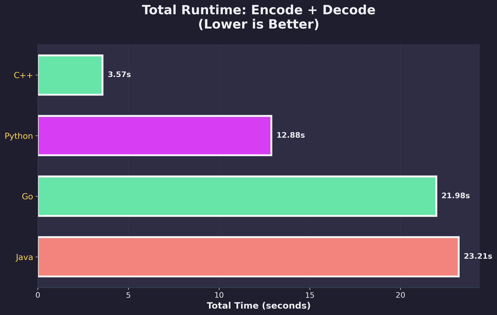
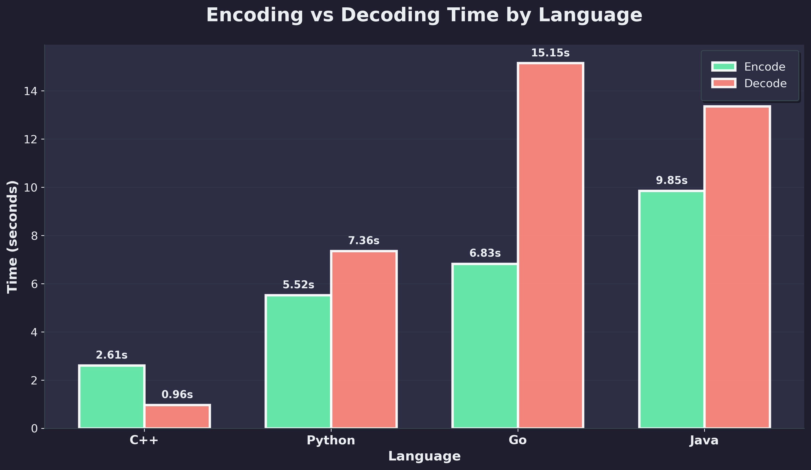
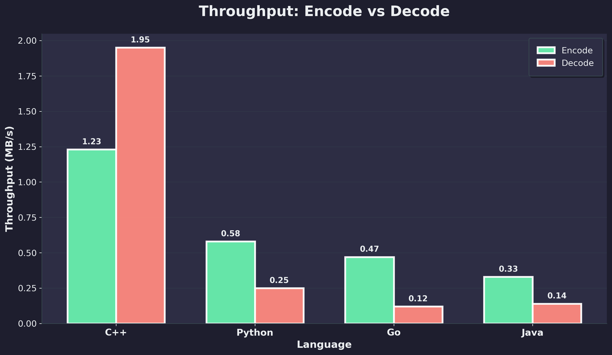
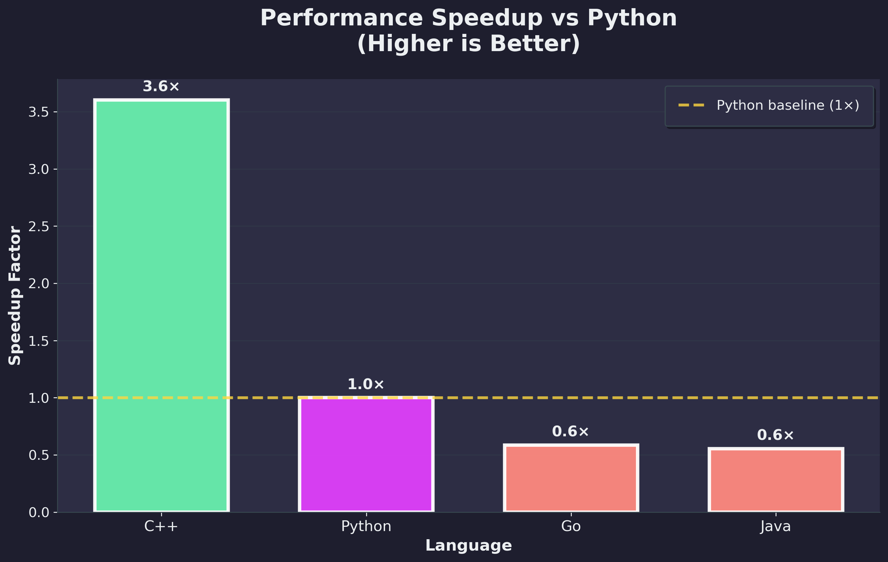

## Results

| Language | Encode | Decode | Total | Throughput |
|----------|--------|--------|-------|--------------|
| C++ | 2.61s | 0.96s | **3.57s** | 1.23 MB/s |
| Python | 5.52s | 7.36s | 12.88s | 0.58 MB/s |
| Go | 6.83s | 15.15s | 21.98s | 0.47 MB/s |
| Java | 9.85s | 13.36s | 23.21s | 0.33 MB/s |

C++ is 6.5x faster than Java. The file compressed from 3.37 MB to ~1.97 MB (42% reduction).

## Run It

```bash
# Benchmark all implementations
python3 scripts/benchmark.py

# Generate charts
pip3 install -r scripts/requirements.txt
python3 scripts/visualize_benchmarks.py
```

Results save to `results/processed/benchmark_results.csv` and `results/plots/`.

## Structure

```
cpp/          CMake build, 17
java/         Maven build, JDK 11
go/           Go 1.25
python/       Python 3
scripts/      benchmark.py, visualize_benchmarks.py
data/         test.txt (3.4MB sample)
results/      CSV and PNG outputs
```

Each implementation follows the same pipeline: frequency counting → tree building → code generation → bit-packed I/O.

## Charts

### Total Runtime Ranking


### Time Breakdown


### Throughput


### Speedup vs Python


## Observations

- C++ wins on both encode and decode
- Python's decode is faster than its encode (buffered I/O efficiency)
- Go and Java have slower decode paths — likely string allocation overhead
- All implementations produce identical compression ratios (~0.585)

## Credits

Thanks to [John Crickett](https://github.com/johncrickett) for the inspiration through [Coding Challenges](https://codingchallenges.fyi/)!